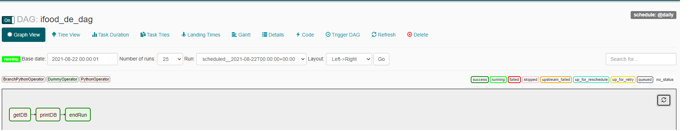

# iFood Data Engineering Test

This are files for the iFood Data Engineering Test by Alejandro Rojas Benitez.

## 1st Case: ETL, Governance and API development

For this part we had a json file available at s3://ifood-data-architect-test-source/order.json.gz. We started a Data Bricks environment using AWS. First, we mounted both ifood-data-architect-test-source bucket and then we mounted my own bucket **ifood-de-test-arb** on us-east-1. 
Credentials were saved on the secrets library from databricks, please contact me if you need access to ifood-de-test-arb bucket. This process can be seen on the first_case/mount_buckets.ipynb file.

We found that the json file had a granularity of Orders, with different items for each order and different garnishes for each item. Given that, we curated that raw data into 3 new tables as orders, items and garnish. Each order has an unique `order_id`,  each item is related to an `order_id` and it has its own `external_id` and finally, each garnish has its own `external_id`, which is related to an item `external_id` and an `order_id`.

The curate process was done using pyspark and can be seen on the first_case/orders.ipynb file. We intentionally printed some of the results so they could be seen on the notebook. The tables are available at s3://ifood-de-test-arb/orders.json , s3://ifood-de-test-arb/items.json, s3://ifood-de-test-arb/garnish.json. Bucket is not public for reading or writing, again if access is needed you can ask me about credentials.

### Data Governance and Catalog
For this section we suggest a Data Catalog using AWS data catalog glue in case money is not a big issue. On the meantime, if for this case scenario there will be a few tables and the company is on a budget, probably using a small webpage that connects to some backend where all the meta data is stored in `.yaml` files could work like a charm. Unfortunately, we did not implement any of this solutions to our orders, items and garnish tables.

### Sandbox: API development
For this case, we needed to develop an API that gives the following results in json format:

-   Count of orders per day for each city and state in our database
-   Top 10 restaurants per customer

We developed the API using Python and Flask. Knowing that if each request will start up a DataBricks cluster and run some SQL operations it would be more expensive then we aggregated those results beforehand and also saved them on the ifood-de-test-arb bucket. They can be found on s3://ifood-de-test-arb/top_rest_by_customer_no_partition.json and s3://ifood-de-test-arb/top_orders_city_state.json. 
Requests are done using S3 Select service by AWS, where we can query on S3 files if the are on json or csv format. This made handling the querys a lot easier and without the need of starting a Data Base service. 

All API files can be found on the /api folder. To run it you have to set up the AWS credentials on /api/Dockerfile lines 6 and 7:

    ENV  ACCESS_KEY=
    
    ENV  SECRET_ACCESS_KEY=

Then, you should move towards the api folder and run:

    docker build -t ifood-de-api-arb .
    docker run -p 5000:5000 ifood-de-api-arb

If everything ran without issues, the api should be available and ready to receive querys. To access them this will be the links:

#### Top 10 restaurants per customer

    http://localhost:5000/api/v1/resources/toprestaurants?id=012d7aa5-9df1-44ef-8218-e115ead9b986
and type in the customer id you want to query. For this example we are querying customer id 012d7aa5-9df1-44ef-8218-e115ead9b986.

#### Count of orders per day for each city 

    http://localhost:5000/api/v1/resources/dailyorders?date=2019-01-28&city=NATAL
and type in the date in format yyyy-mm-dd and city in upper case. For this case we are querying date 2019-01-28 on the city NATAL.

#### Count of orders per day for each state

    http://localhost:5000/api/v1/resources/dailyorders?date=2019-01-28&state=SP
and type in the date in format yyyy-mm-dd and state in upper case. For this case we are querying date 2019-01-28 on the city SP.

Using S3 select showed up to be an efficient and cost effective solution for simple datasets without the need of starting any Data Base services like Athena from AWS.

## 2nd Case: Task Orchestration Platform

For this case, we needed to deploy a simple and scalable Apache Airflow platform. We used Kubernetes on minikube and airflow default templates with the help of https://medium.com/@ipeluffo/running-apache-airflow-locally-on-kubernetes-minikube-31f308e3247a. Huge thanks to @ipeluffo for this well structured guide. This code was ran on Windows 10, using `minikube` version v1.22.0 , `kubectl` version Major:1  Minor:22 and `docker` version 19.03.13.

Unfortunately I was not able to find how to deploy Kubernetes on a Docker Image, but still I'll show here how to run this code.
First, we will need to install in our machine `minikube` , `kubectl` and `Docker`. Then we can just navigate to our /second_case folder, and run:
If using Windows Powershell:

    run_kubernetes.ps1
    run_kubernetes.ps2
   in case we want to delete the pods we can just run `script-delete.ps1`

If using Bash:

    run_kubernetes.sh
    run_kubernetes.sh
   in case we want to delete the pods we can just run `script-delete.sh`

This will start our Airflow Platform, with only 1 DAG 
Note: It can take some minutes for the Airflow Platform to show up. 

To run it we have to move the switch on the DAG `ifood_de_dag` to `ON`. This will start all our tasks, where the first one `getDB` consists on downloading a file from [https://ifood-data-architect-test-source.s3-sa-east-1.amazonaws.com/consumer.csv.gz](https://ifood-data-architect-test-source.s3-sa-east-1.amazonaws.com/consumer.csv.gz) , saving it locally and running the next task `printDB` that reads the file and prints it. 

The .csv file is saved in the same persistent volume as the logs, which is shared between every pod that the kubernetes executor created for our Airflow DAGs. Finally, to check that the task ran successfully and printed the file, we can go ahead and read the logs of the file. 

We don't need any AWS credentials for this case, since we don't use my bucket ifood-de-test-arb.

### Special Thanks
Special Thanks to Denisse Alvarez and Mateo Ramirez for all their recommendations during this test and for answering my panic Whatsapp messages even on Sundays. 
Also some references of projects and webpages that helped me a lot to finish this test:

 - https://medium.com/@ipeluffo/running-apache-airflow-locally-on-kubernetes-minikube-31f308e3247a
 - https://github.com/renatootescu/ETL-pipeline
 - https://programminghistorian.org/en/lessons/creating-apis-with-python-and-flask
